# Klavgen handwired keyboard generator

Klavgen is a handwired keyboard generator written in Python, on top of [CadQuery](https://github.com/CadQuery/cadquery).
It produces keyboards (like on the left) and makes handwiring easy and organized via switch holders (on the right):

<p align="center">
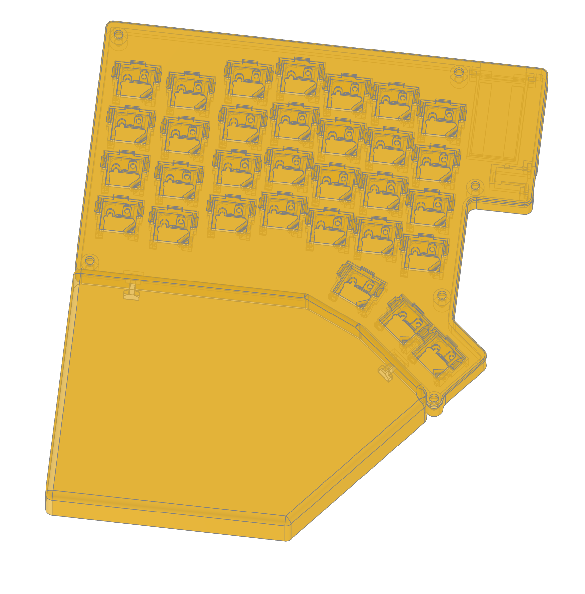
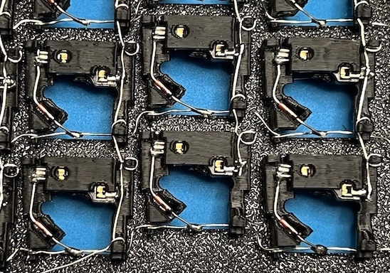
</p>

**Note:** Klavgen is heavily work-in-progress and lots of stuff may not be working. If you experience issues, please
submit a Github issue.

Klavgen benefits:

- Generates all the shells and support structures you need for a keyboard, in a way that's optimized for home **FDM
  printing with no supports**
- Is **low height**: only 11 mm in the default configuration)
- Uses Kailh **hotswap sockets**
- Makes it **easy to solder** things, and requires no glue whatsoever
- Uses **uninsulated wires**, thus no tedious wire stripping
- Makes it easy to **reposition the keys after making the keybaord**
- Produces a sturdy build that **doesn't flex** when typed on

The last 5 benefits are achieved by using switch holders that organize the wires, hold the Kailh sockets and diodes,
support the switches, enable soldering everything in place, and allow moving keys later (they even have wire slack so
you can space keys further apart).

As of now:

- Code is still quite messy and not fully parameterized
- Configuring a keyboard requires code, it's not as easy as YAML
- Docs are scarce (as you'll see below)

# Example STL outputs

See the [`example_stls`](example_stls) directory for example STL outputs. These were generated by
[`example.py`](example.py), see more about that below.

| Component                                                                                                                                                                                   | STL file                                                      | Preview                                                                                                    |
| ------------------------------------------------------------------------------------------------------------------------------------------------------------------------------------------- |---------------------------------------------------------------| ---------------------------------------------------------------------------------------------------------- |
| **Bottom**                                                                                                                                                                                  | [`keyboard_bottom.stl`](example_stls/keyboard_bottom.stl)     | <p align="center">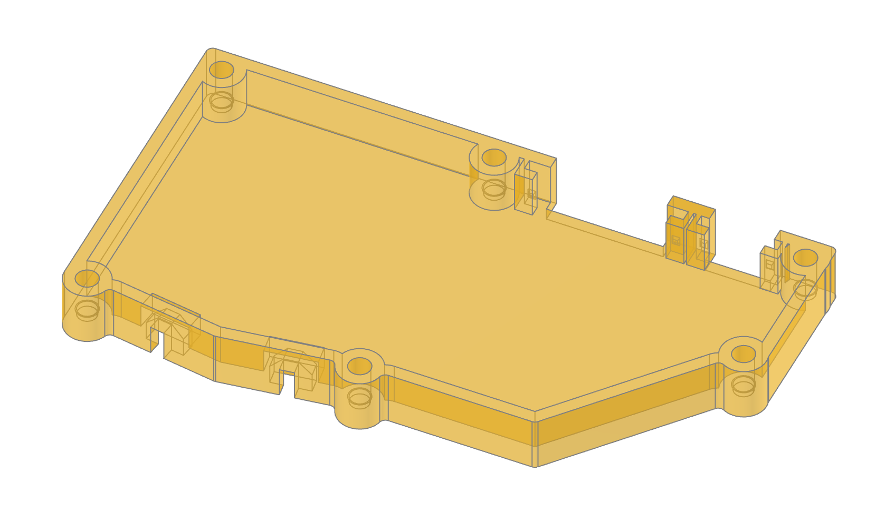</p>                      |
| **Top plate**: flat with simple holes so that it can be made with a laser cutter or a CNC machine                                                                                           | [`keyboard_top.stl`](example_stls/keyboard_top.stl)           | <p align="center">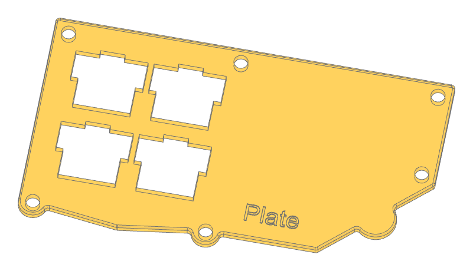</p>                            |
| **Palm rest**: attaches to the bottom via connectors (can also be fused with the bottom, see below)                                                                                         | [`palm_rest.stl`](example_stls/palm_rest.stl)                 | <p align="center">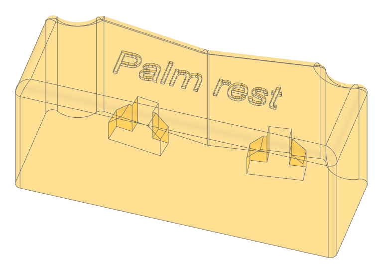</p>           |
| **Switch holder**: Holds the Kailh hotswap socket and allows you to solder the diode, column and row wires in-place. These should be printed in ABS since the soldering iron will be close. | [`switch_holder.stl`](example_stls/switch_holder.stl)         | <p align="center">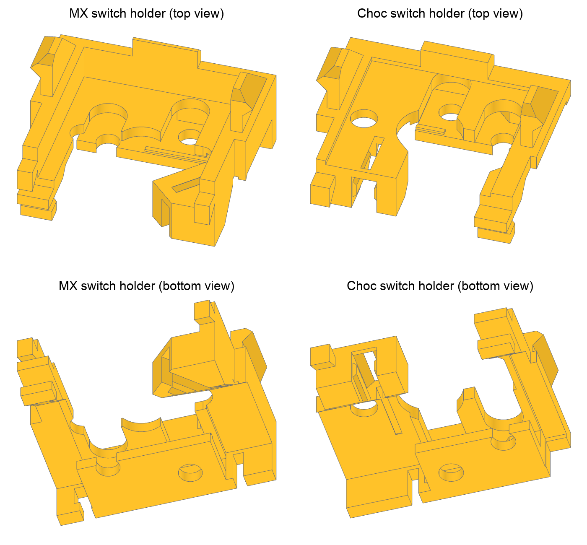</p>        |
| **Pro Micro controller holder**: holds the Arduino Pro Micro                                                                                                                                | [`controller_holder.stl`](example_stls/controller_holder.stl) | <p align="center">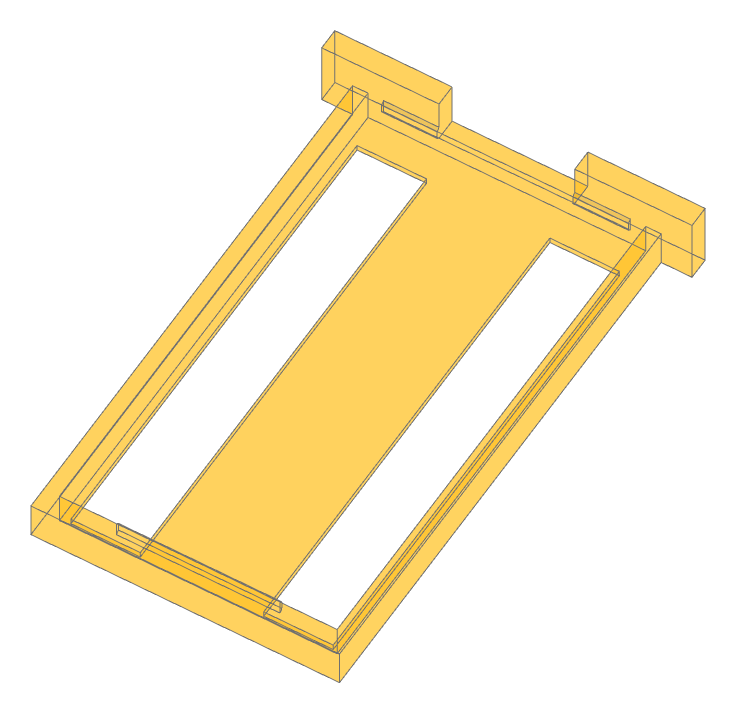</p> |
| **TRRS jack holder**: holds the TRRS jack                                                                                                                                                   | [`trrs_jack_holder.stl`](example_stls/trrs_jack_holder.stl)   | <p align="center">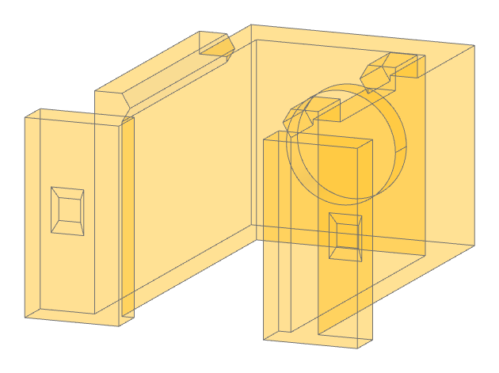</p>  |
| **Connector**: connectrs the palm rest to the bottom                                                                                                                                        | [`connector.stl`](example_stls/connector.stl)                 | <p align="center">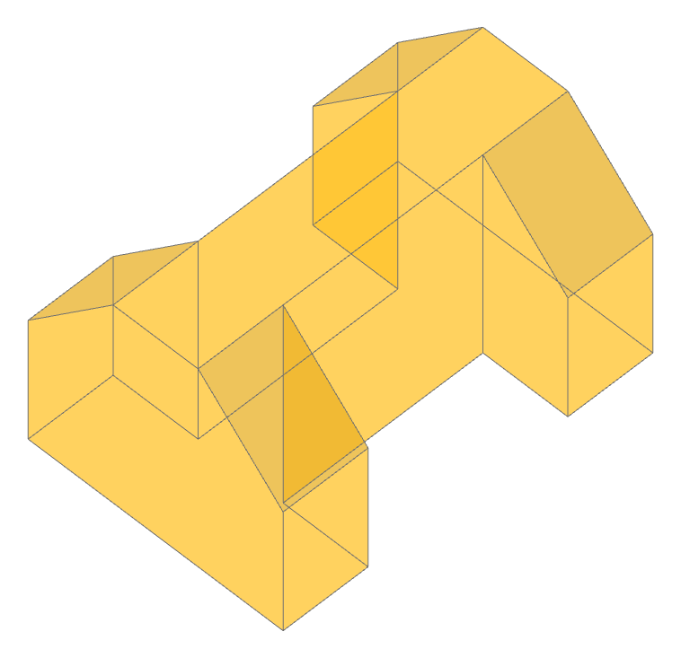</p>                |

# Example generated keyboards

## Klavyl

[Klavyl](https://github.com/klavgen/klavyl) is my personal keyboard, a modification to
[Redox](https://github.com/mattdibi/redox-keyboard). It uses most of Klavgen's capabilities, including screw holes,
manually defined case outlines, Pro Micro and TRRS jack cutouts and holders, and palm rests. Check out the repo for the
full config.

<p align="center">

</p>

## Redox

The [Redox](https://github.com/mattdibi/redox-keyboard) keyboard, as generated by Klavgen based on its
[Keyboard Layout Editor config](<http://www.keyboard-layout-editor.com/##@_name=Redox&author=Mattia%20Dal%20Ben&switchMount=cherry&plate:false&pcb:false%3B&@_x:3.5%3B&=%23%0A3&_x:10.5%3B&=*%0A8%3B&@_y:-0.875&x:2.5%3B&=%2F@%0A2&_x:1%3B&=$%0A4&_x:8.5%3B&=%2F&%0A7&_x:1%3B&=(%0A9%3B&@_y:-0.875&x:5.5%3B&=%25%0A5&_x:6.5%3B&=%5E%0A6%3B&@_y:-0.875&x:0.25&a:5&w:1.25%3B&=%60%0A%0A%0A%0A%0A%0ALayer%202&_a:4%3B&=!%0A1&_x:14.5%3B&=)%0A0&_a:5&w:1.25%3B&=-%0A%0A%0A%0A%0A%0ALayer%202%3B&@_y:-0.625&x:6.5%3B&=Layer%201&_x:4.5%3B&=Layer%201%3B&@_y:-0.75&x:3.5&a:4%3B&=E&_x:10.5%3B&=I%3B&@_y:-0.875&x:2.5%3B&=W&_x:1%3B&=R&_x:8.5%3B&=U&_x:1%3B&=O%3B&@_y:-0.875&x:5.5%3B&=T&_x:6.5%3B&=Y%3B&@_y:-0.875&x:0.25&a:5&w:1.25%3B&=TAB&_a:4%3B&=Q&_x:14.5%3B&=P&_a:5&w:1.25%3B&=%2F=%3B&@_y:-0.625&x:6.5&a:7&h:1.5%3B&=%5B&_x:4.5&h:1.5%3B&=%5D%3B&@_y:-0.75&x:3.5&a:4%3B&=D&_x:10.5%3B&=K%3B&@_y:-0.875&x:2.5%3B&=S&_x:1&n:true%3B&=F&_x:8.5&n:true%3B&=J&_x:1%3B&=L%3B&@_y:-0.875&x:5.5%3B&=G&_x:6.5%3B&=H%3B&@_y:-0.875&x:0.25&a:5&w:1.25%3B&=ESC&_a:4%3B&=A&_x:14.5%3B&=%2F:%0A%2F%3B&_a:5&w:1.25%3B&='%3B&@_y:-0.375&x:3.5&a:4%3B&=C&_x:10.5%3B&=%3C%0A,%3B&@_y:-0.875&x:2.5%3B&=X&_x:1%3B&=V&_x:8.5%3B&=M&_x:1%3B&=%3E%0A.%3B&@_y:-0.875&x:5.5%3B&=B&_x:6.5%3B&=N%3B&@_y:-0.875&x:0.25&a:5&w:1.25%3B&=SHIFT&_a:4%3B&=Z&_x:14.5%3B&=%3F%0A%2F%2F&_a:5&w:1.25%3B&=SHIFT%3B&@_y:-0.375&x:3.5%3B&=*%0A%0A%0A%0A%0A%0AALT&_x:10.5%3B&=Left%3B&@_y:-0.875&x:2.5%3B&=-&_x:12.5%3B&=Down%3B&@_y:-0.75&x:0.5%3B&=GUI&=+&_x:14.5%3B&=Up&=Right%3B&@_r:15&y:-2.625&x:5.75&w:1.25%3B&=%5C%0A%0A%0A%0A%0A%0ACTRL%3B&@_r:30&rx:6.5&ry:4.25&y:-1%3B&=PgUp&=PgDn%3B&@_h:1.5%3B&=Back%0A%0A%0A%0A%0A%0Aspace&_h:1.5%3B&=Del%3B&@_r:-30&rx:13&y:-1&x:-2%3B&=Home&=End%3B&@_x:-2&h:1.5%3B&=Enter&_h:1.5%3B&=Space%3B&@_r:-15&rx:0&ry:0&y:7.75&x:11.75&w:1.25%3B&=ALT>):

<p align="center">
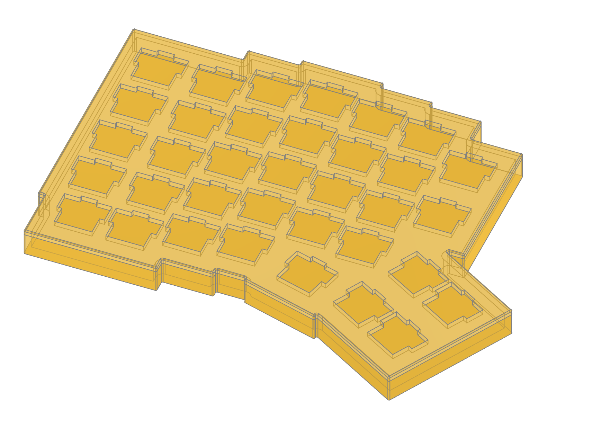
</p>

## Ergodox

The [Ergodox](https://www.ergodox.io/) keyboard, as generated by Klavgen based on its
[Keyboard Layout Editor config](<http://www.keyboard-layout-editor.com/##@@_x:3.5%3B&=%23%0A3&_x:10.5%3B&=*%0A8%3B&@_y:-0.875&x:2.5%3B&=%2F@%0A2&_x:1%3B&=$%0A4&_x:8.5%3B&=%2F&%0A7&_x:1%3B&=(%0A9%3B&@_y:-0.875&x:5.5%3B&=%25%0A5&_a:7%3B&=&_x:4.5%3B&=&_a:4%3B&=%5E%0A6%3B&@_y:-0.875&a:7&w:1.5%3B&=&_a:4%3B&=!%0A1&_x:14.5%3B&=)%0A0&_a:7&w:1.5%3B&=%3B&@_y:-0.375&x:3.5&a:4%3B&=E&_x:10.5%3B&=I%3B&@_y:-0.875&x:2.5%3B&=W&_x:1%3B&=R&_x:8.5%3B&=U&_x:1%3B&=O%3B&@_y:-0.875&x:5.5%3B&=T&_a:7&h:1.5%3B&=&_x:4.5&h:1.5%3B&=&_a:4%3B&=Y%3B&@_y:-0.875&a:7&w:1.5%3B&=&_a:4%3B&=Q&_x:14.5%3B&=P&_a:7&w:1.5%3B&=%3B&@_y:-0.375&x:3.5&a:4%3B&=D&_x:10.5%3B&=K%3B&@_y:-0.875&x:2.5%3B&=S&_x:1%3B&=F&_x:8.5%3B&=J&_x:1%3B&=L%3B&@_y:-0.875&x:5.5%3B&=G&_x:6.5%3B&=H%3B&@_y:-0.875&a:7&w:1.5%3B&=&_a:4%3B&=A&_x:14.5%3B&=%2F:%0A%2F%3B&_a:7&w:1.5%3B&=%3B&@_y:-0.625&x:6.5&h:1.5%3B&=&_x:4.5&h:1.5%3B&=%3B&@_y:-0.75&x:3.5&a:4%3B&=C&_x:10.5%3B&=%3C%0A,%3B&@_y:-0.875&x:2.5%3B&=X&_x:1%3B&=V&_x:8.5%3B&=M&_x:1%3B&=%3E%0A.%3B&@_y:-0.875&x:5.5%3B&=B&_x:6.5%3B&=N%3B&@_y:-0.875&a:7&w:1.5%3B&=&_a:4%3B&=Z&_x:14.5%3B&=%3F%0A%2F%2F&_a:7&w:1.5%3B&=%3B&@_y:-0.375&x:3.5%3B&=&_x:10.5%3B&=%3B&@_y:-0.875&x:2.5%3B&=&_x:1%3B&=&_x:8.5%3B&=&_x:1%3B&=%3B&@_y:-0.75&x:0.5%3B&=&=&_x:14.5%3B&=&=%3B&@_r:30&rx:6.5&ry:4.25&y:-1&x:1%3B&=&=%3B&@_h:2%3B&=&_h:2%3B&=&=%3B&@_x:2%3B&=%3B&@_r:-30&rx:13&y:-1&x:-3%3B&=&=%3B&@_x:-3%3B&=&_h:2%3B&=&_h:2%3B&=%3B&@_x:-3%3B&=>):

<p align="center">
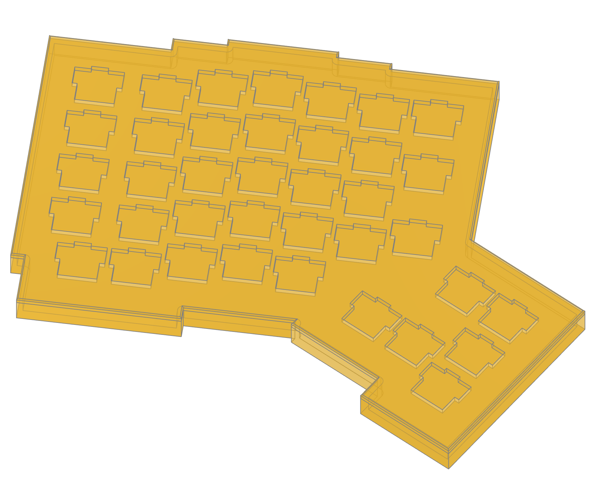
</p>

## Atreus

The [Atreus](https://gitlab.com/technomancy/atreus) keyboard, as generated by Klavgen based on its
[Keyboard Layout Editor config](http://www.keyboard-layout-editor.com/##@@_r:10&rx:1&y:-0.09999999999999998&x:2%3B&=E%3B&@_y:-0.65&x:1%3B&=W&_x:1%3B&=R%3B&@_y:-0.75%3B&=Q%3B&@_y:-0.9&x:4%3B&=T%3B&@_y:-0.7000000000000001&x:2%3B&=D%3B&@_y:-0.6499999999999999&x:1%3B&=S&_x:1%3B&=F%3B&@_y:-0.75%3B&=A%3B&@_y:-0.8999999999999999&x:4%3B&=G%3B&@_y:-0.7000000000000002&x:2%3B&=C%3B&@_y:-0.6499999999999999&x:1%3B&=X&_x:1%3B&=V%3B&@_y:-0.75%3B&=Z%3B&@_y:-0.8999999999999999&x:4%3B&=B%3B&@_y:-0.75&x:5&h:1.5%3B&=Ctrl%3B&@_y:-0.9500000000000002&x:2%3B&=super%3B&@_y:-0.6499999999999999&x:1%3B&=Tab&_x:1%3B&=Shift%3B&@_y:-0.75%3B&=Esc%3B&@_y:-0.8999999999999999&x:4%3B&=Bksp%3B&@_r:-10&rx:7&ry:0.965&y:-0.20000000000000018&x:2%3B&=I%3B&@_y:-0.6499999999999999&x:1%3B&=U&_x:1%3B&=O%3B&@_y:-0.75&x:4%3B&=P%3B&@_y:-0.8999999999999999%3B&=Y%3B&@_y:-0.7000000000000002&x:2%3B&=K%3B&@_y:-0.6499999999999999&x:1%3B&=J&_x:1%3B&=L%3B&@_y:-0.75&x:4%3B&=%2F:%0A%2F%3B%3B&@_y:-0.8999999999999999%3B&=H%3B&@_y:-0.7000000000000002&x:2%3B&=%3C%0A,%3B&@_y:-0.6499999999999999&x:1%3B&=M&_x:1%3B&=%3E%0A.%3B&@_y:-0.7500000000000004&x:4%3B&=%3F%0A%2F%2F%3B&@_y:-0.9000000000000004%3B&=N%3B&@_y:-0.7499999999999996&x:-1&h:1.5%3B&=Alt%3B&@_y:-0.9499999999999997&x:2%3B&=%2F_%0A-%3B&@_y:-0.6500000000000004&x:1%3B&=fn&_x:1%3B&=%22%0A'%3B&@_y:-0.75&x:4%3B&=Enter%3B&@_y:-0.9000000000000004%3B&=Space):

<p align="center">
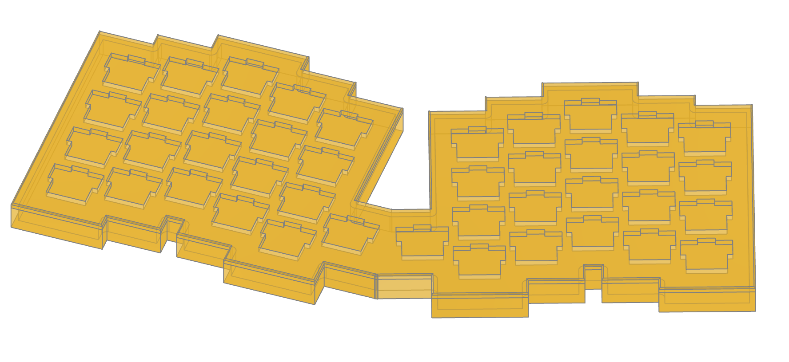
</p>

# Installing

## 1. Install CadQuery

Install Miniconda and create an environment for CadQuery, following the
[official instructions](https://cadquery.readthedocs.io/en/latest/installation.html#installation).

## 2. Get comfortable using CadQuery

Get familiar with either of CadQuery's UIs: [CQ-editor](https://github.com/CadQuery/CQ-editor) or
[jupyter-cadquery](https://github.com/bernhard-42/jupyter-cadquery) (which I prefer).

Ensure that you know how to view objects returned from code, using `show_object()` in CQ-editor or `show()` in Jupyter
Lab (from `jupyter_cadquery.cadquery`).

## 3. Download Klavgen

Klavgen is not yet packaged, so you need to download and use it locally within a project (clone or download and extract
the ZIP file; example assumes cloning).

```
git clone git@github.com:klavgen/klavgen.git
```

Start your project in the `klavgen` repo directory. This is where you'll have to write your scripts for now, since you
need to import the `klavgen` package (which is in a sub-dir):

# WARNING!!!

CadQuery is very finicky when it comes to filleting (the `fillet()` command), and sometimes when it comes to shelling
(the `shell()` command). Klavgen tries to provide helpful error messages when CadQuery fails, please follow them. In
general, it is highly recommended to always provide the `case_extras` parameter or use a `Patch` object to define the
outline of your case to ensure there are no small features or holes that can trip filleting or shelling.

If rendering fails in a shell, you should try `render_case()` with `debug=True`, which skips the shell step.

The 2 most important fillet settings, `CaseConfig.side_fillet` and `CaseConfig.palm_rests_top_fillet` are disabled by
default, which makes default keyboards ugly.

These are the main gotchas:

- Shelling fails because your case is not continuous (e.g. the thumb cluster doesn't connect to the main body), has very
  sharp corners, or has small features.
- Filleting fails because the object has features smaller than the fillet size.
- Filleting succeeds but produces an invalid shape that later on causes errors when operated on (e.g. via a `.cut()`).

# Tutorial

Note that all the `show()` commands below are meant to illustrate the use in Jupyter Lab. If you use CQ-editor, the
commands may differ.

## 1. Generate a 1-key keyboard case

Run the following code to generate a single-key keyboard:

```
from klavgen import *

keys = [
    Key(x=0, y=0),
]

case_result = render_case(keys=keys)
```

The `render_case()` method is the method you'll use most often while designing the keyboard. It returns a fairly complex
`RenderCaseResult` object which tracks the full progress of the keyboard construction to help you in fixing issues.

**Note**: You can pass in a `RenderCaseResult` object as the `result` parameter. Then, `render_case()` will save
intermediate objects to the passed-in variable while rendering is taking place, allowing you to observe what happened if
rendering raises an exception.

Here, we'll only focus on these 3 keys part in the `result` object:

- `case_result.top` is the top plate (`show(case_result.top)`)

<p align="center">
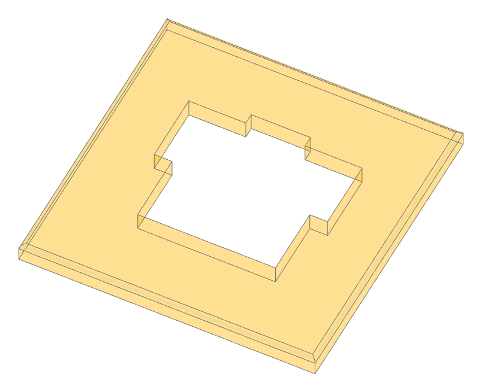
</p>

- `case_result.bottom` is the case bottom (`show(case_result.bottom)`)

<p align="center">
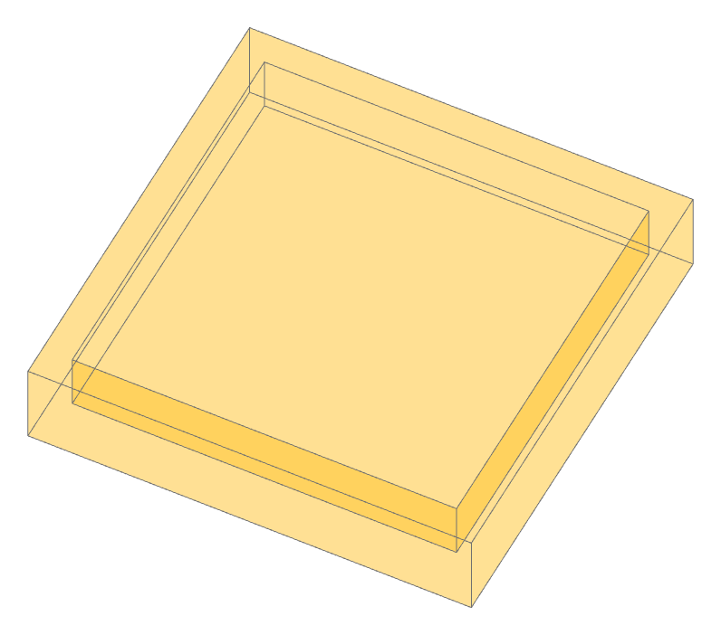
</p>

- `case_result.debug` shows key and holder outlines, helping you debug designs. This part should not be saved or used.
  By default, the outlines use the keycap width and depth from the configuration, but you can also pass in
  `keycap_width` and `keycap_depth` parameters to `Key()` to adjust these per key.

Rendering all 3 shows you the bottom, top and the debug outline in the air
((`show(case_result.top, case_result.bottom, case_result.debug)`):

<p align="center">
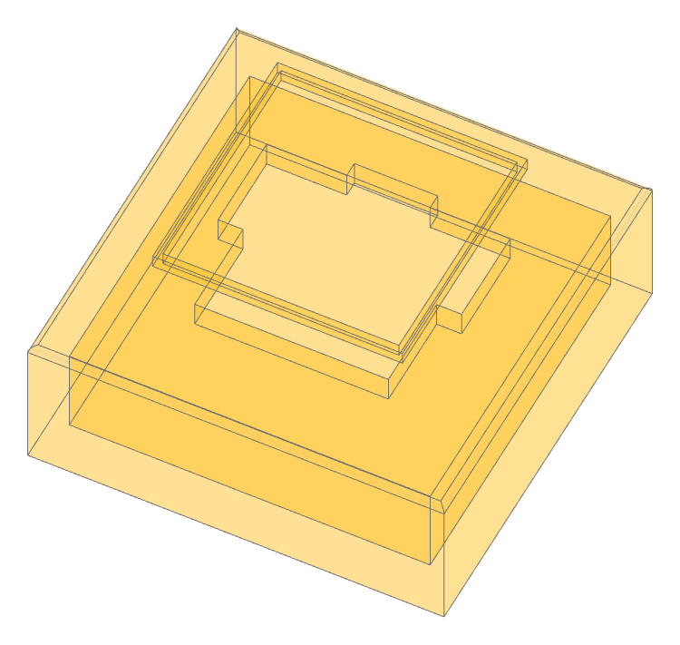
</p>

## 2. Save the 1-key keyboard case

You can now export the dummy "keyboard" you created, via the `render_and_save_keyboard()` method, which takes the same
parameters as `render_case()`.

```
keyboard_result = render_and_save_keyboard(keys=keys)
```

You should see a series of `.stl` files in your working directly. The files depend on the features your keyboard uses.
For now, you will only see the top plate, the case bottom, and the switch holder. For a complete keyboard, you may also
see the controller holder, the TRRS jack holder, palm rest(s), and the palm rests connector.

The `render_and_save_keyboard()` method renders the case (and takes the same parameters as `render_case()`) and then
saves all relevant components to `.stl` files. It returns an object of type `RenderKeyboardResult`. In the current
example, that object contains only the `.case_result`, `.top`, `.bottom`, and `.switch_holder` items. See below for the
full list of members.

## 3. Generate a more complex case

This is a more complex "keyboard", with screw holes and a palm rest:

```
from klavgen import *

config = Config()

keys = [
    Key(x=0, y=0, keycap_width=18, keycap_depth=18)
]

screw_holes = [
    ScrewHole(x=13, y=13),
    ScrewHole(x=13, y=-13),
    ScrewHole(x=-13, y=-13),
]

palm_rests = [
    PalmRest(
        points=[
            (13, -5),
            (13, -30),
            (-13, -30),
            (-13, -5)
        ],
        height=config.case_config.case_base_height + 2,
        connector_locations_x = [0]
    ),
]

case_result = render_case(keys=keys, palm_rests=palm_rests, screw_holes=screw_holes, config=config)
```

This time, besides the `case_result.top` and `case_result.bottom` objects, you can also check out the
`case_result.palm_rests[0]` one to see the palm rest.

This is the result (`show(result.top, result.bottom, result.palm_rests[0])`):

<p align="center">
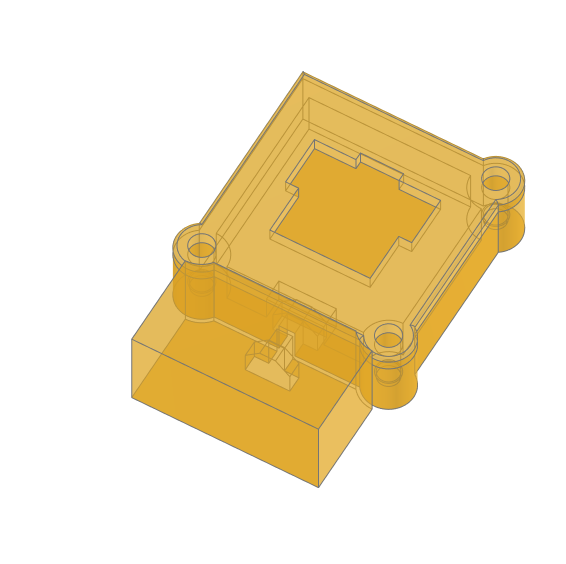
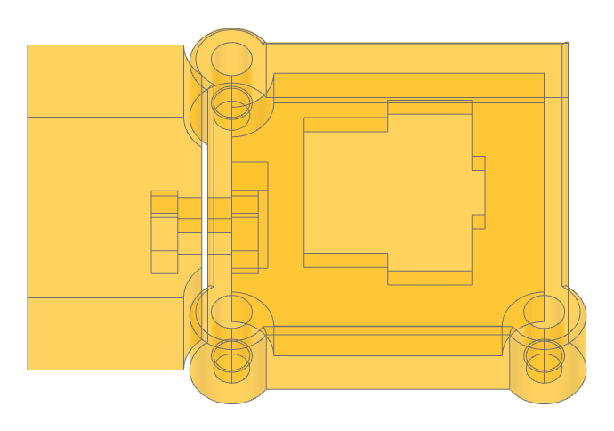
</p>

Note that the palm rest is detachable. You can make it part of the bottom by changing the config to:

```
config = Config(case_config=CaseConfig(detachable_palm_rests=False))
```

Now the `case_result.palm_rests` object is `None` so don't try to view it. Instead just check out the case bottom
(`show(result.bottom)`):

<p align="center">
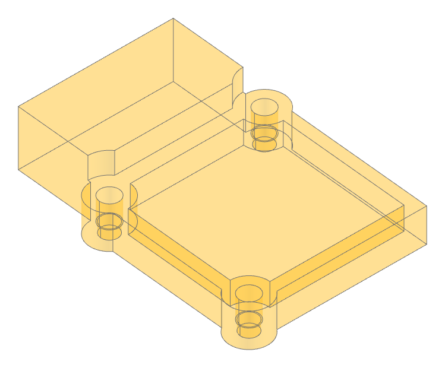
</p>

## 4. Generate a keyboard with all of Klavgen's features

Check out the [`example.py`](example.py) file, which builds a dummy keyboard using all of Klavgen's features.

This is the result (`show(keyboard_result.top, keyboard_result.bottom, keyboard_result.palm_rests[0])`):

<p align="center">
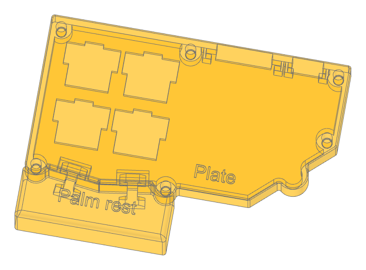
</p>

# Extras

## Use a Keyboard Layout Editor export

You can build a keyboard from a [Keyboard Layout Editor](http://www.keyboard-layout-editor.com/) layout. Do the
following:

1. Ensure the layout is contiguous. If it's a split keyboard, manually remove all the keys from one of the splits before
   exporting.

1. Go to the "Raw Data" tab and click "Download JSON" on the bottom right.

1. Run code like the following to generate the list of keys:

   ```
   from klavgen import *

   keys = generate_keys_from_kle_json("<path to downloaded json file>") 
   ```

By default, keys are spaced 19.05mm apart. You can adjust this by passing the `step_size` parameter.

You can then use the standard `render_case()` or `render_and_save_keyboard()` methods to render the keyboard (see
above).

# Important constructs

## Important configs

- `CaseConfig.detachable_palm_rests` allows you to set whether palm rests should be detachable, or part of the case
  bottom.
- `CaseConfig.side_fillet` sets a fillet on the case vertical edges. You should likely always use it in the final
  product, but it's very prone to failure, see warning above.
- `CaseConfig.palm_rests_top_fillet` sets a fillet on the palm rest top edges. You should likely always use it the final
  product if you have palm rests (so they don't dig in your hands), but it's very prone to failure, see warning above.
- `ScrewHoleConfig.screw_insert_hole_width` sets the size of the hole for screws and defaults to a value suitable for
  melting inserts. If you don't use inserts, you should lower the value.
- `KeyConfig.case_tile_margin`, `ControllerConfig.case_tile_margin` and `TrrsJackConfig.case_tile_margin` is the size of
  the case generated around keys, controller holders, and TRRS jack holders. If you use `case_extras` or a `Patch`
  object to define your outlines, you can freely lower these.

## The `render_standard_components` parameter

When `render_standard_components` is set to `True` in a call to `render_case`, all holders (switch, controller, TRRS
jack) and palm rest connectors are returned in the `.standard_components` object. These help you see what the final
keyboard will look like.

This is what `example.py` looks like with standard components added
(`show(keyboard_result.top, keybaord_result.bottom, keyboard_result.palm_rests[0], keyboard_result.case_result.standard_components)`):

<p align="center">
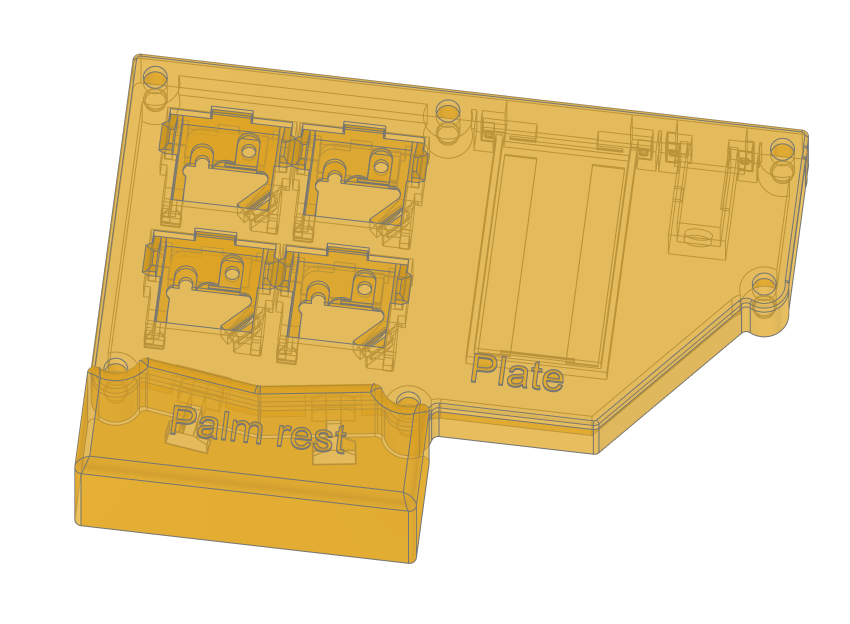
</p>

## The `RenderCaseResult` object returned from `render_case()`

This object contains the individual steps when constructing the case. They key outputs are 3:

- `case_result.top` is the top plate
- `case_result.bottom` is the case bottom
- `case_result.palm_rests` is a **list** of palm rest objects
- `case_result.standard_components` is a rendering of all holders (switch, controller, TRRS jack) and palm rest
  connectors (see above).

Additionally, there are many intermediate objects that are useful for troubleshooting and auditing when something is not
going right.

## The `RenderKeyboardResult` object returned from `render_and_save_keyboard()`

This object contains the final keyboard components:

- `keyboard_result.case_result` is the `RenderCaseResult` returned from the inner `render_case()` method. Always
  present.
- `keyboard_result.top` is the top plate (same as `case_results.top`). Always present.
- `keyboard_result.bottom` is the case bottom (same as `case_results.bottom`). Always present.
- `keyboard_result.switch_holder` is the switch holder. Always present.
- `keyboard_result.connector` is the palm rests to case bottom connector. Present only if palm rests are defined and
  `CaseConfig.detachable_palm_rests` is `True`.
- `keyboard_result.controller_holder` is the controller holder. Present only if a controller is defined.
- `keyboard_result.trrs_jack_holder` is the TRRS jack holder. Present only if a TRRS jack is defined.
- `keyboard_result.palm_rests` is a **list** of palm rest objects (same as `case_results.palm_rests`). Present only if
  at least one palm rest is defined.
